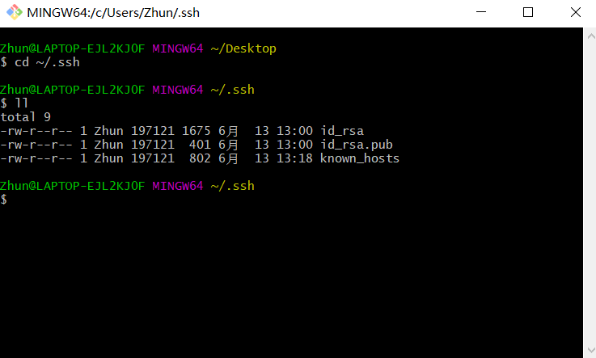
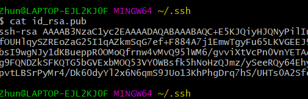
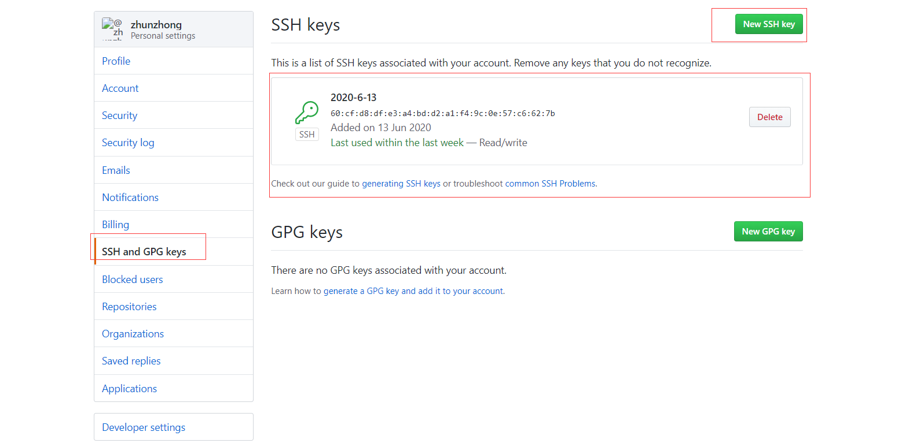

# 配置sshkey关联github

&ensp;&ensp;如果不配置sshkey关联，每次pull或者push都需要输入github的账免密。此外注意要使用ssh格式的地址而不是https格式

```
两种格式地址比较:
git@github.com:zhunzhong/linux-docs.git
https://github.com/zhunzhong/linux-docs.git
```

具体配置步骤
*****************

> step1 设置git的user name和email

如果你是第一次使用，或者还没有配置过的话需要操作一下命令，自行替换相应字段
```
git config --global user.name "zhunzhong"
git config --global user.email  "zhunzhong@email.com"

```
说明：git config --list 查看当前Git环境所有配置，还可以配置一些命令别名之类的。

> step2 检查是否存在SSH Key

```
cd ~/.ssh
ll
#查看是否存在id_rsa或者id_rsa.pub，如果已经存在说明已经有配置ssh key
```

如下图


如果没有SSH Key，则需要先生成一下
```
ssh-keygen -t rsa -C "zhunzhong@email.com"
```

> step3 获取SSH Key

```
cat id_rsa.pub
```

如下图  



> step4 GitHub添加SSH Key  

GitHub点击用户头像，选择setting  



任意设置名字，把上面生成秘钥(id_rsa.pub内容)复制进去

> step5 验证和修改

```
ssh -T git@github.com

#运行结果出现
Hi zhunzhong! You've successfully authenticated, but GitHub does not provide shell access.
表示配置ok
```
之前已经是https的链接，现在想要用SSH提交怎么办？
直接修改项目目录下 .git文件夹下的config文件，将地址修改一下就好了